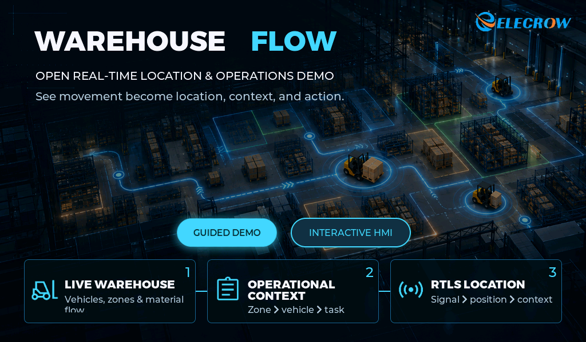
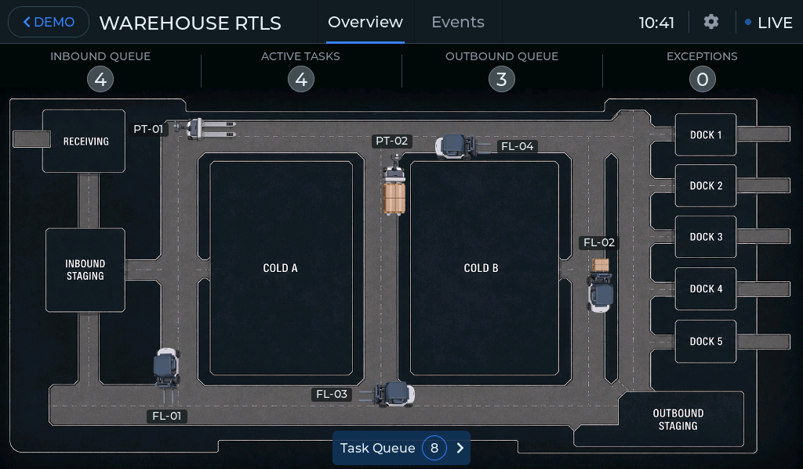
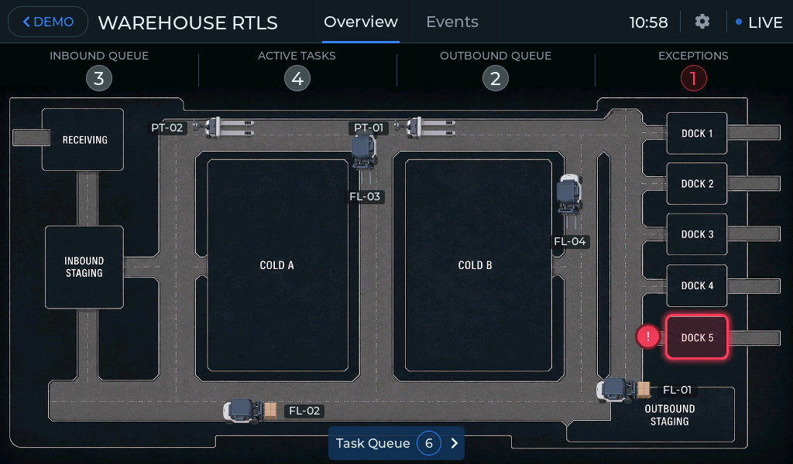

# Warehouse Flow RTLS Demo

Warehouse HMI demonstration for **Elecrow CrowPanel Advanced ESP32-P4 panels with 1024 × 600 touch displays**. It gives a supervisor or dispatcher a view of moving vehicles, pallet transfers, tasks, and operational events across a distribution warehouse.

## Interactive HMI

Explore the warehouse through **Overview** and **Events**. Open zones, vehicles, pallets, and the Task Queue to follow an operation from its location to its history and explanation.

- Watch four forklifts and two pallet trucks handle 25 pallets across receiving, staging, cold storage, and five shipping docks.
- Inspect current loads, transport stages, destinations, and movement history.
- Locate active exceptions on the map and open the evidence behind them.
- Follow an exception from its active state to its resolution in event history.

<table width="100%">
  <tr>
    <td width="50%"></td>
    <td width="50%"></td>
  </tr>
  <tr>
    <td align="center"><strong>Normal operation</strong></td>
    <td align="center"><strong>Active exception on the map</strong></td>
  </tr>
</table>

Select an image to open the full 1024 × 600 screenshot.

At startup, choose **Guided Demo** for a short presentation or **Interactive HMI** to explore the running warehouse. The demo uses a local simulation; real UWB tags, anchors, and an external location service are not required.

## Download

**[Download the ready-to-use Windows package — V1.2 / firmware v1.7](./CrowPanelv1.2_Warehouse_v1.7.zip)**

### Requirements

- Elecrow CrowPanel Advanced ESP32-P4;
- Windows computer;
- data-capable USB-C cable.

## Flashing

1. Download and fully extract `CrowPanelv1.2_Warehouse_v1.7.zip`.
2. Connect the panel’s **UART0 USB-C port** to a Windows computer using a data-capable USB cable.
3. Open the extracted folder.
4. Run `CrowPanel_P4_fast_flasher.exe`.
5. Select the panel's COM port. Click **Refresh** if the port is not listed.
6. Make sure **Clean install (erase entire flash)** is enabled.
7. Click **Flash panel**.
8. Do not disconnect the panel while flashing.
9. Wait for the **Firmware installed successfully** message.

The panel restarts automatically after flashing.

A clean install erases the panel's existing flash contents.

## Troubleshooting

If the panel is not detected, reconnect it through UART0, close any application using the COM port, and click **Refresh**.

## Documentation

- [Project Description](description/description.md) — illustrated tour and customization options.
- [User Manual](USER_MANUAL.md) — navigation and practical instructions.
