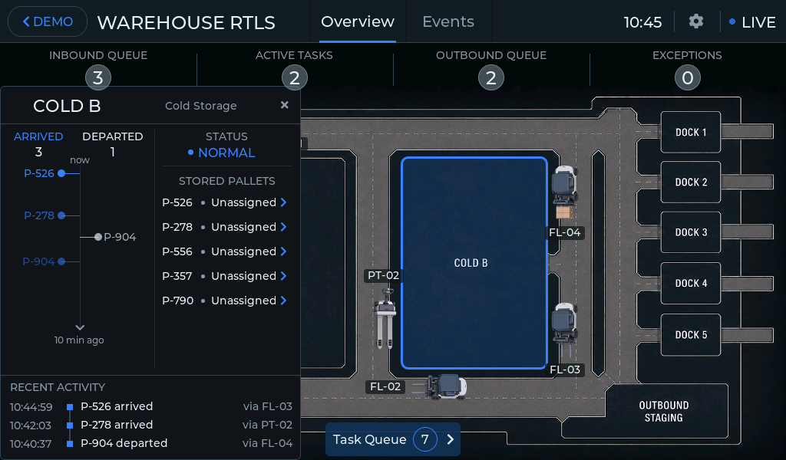
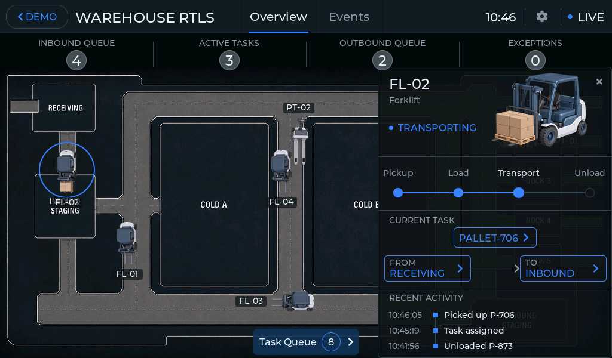
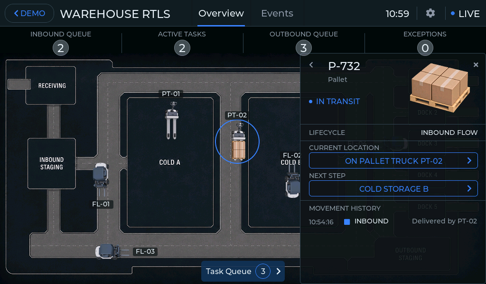
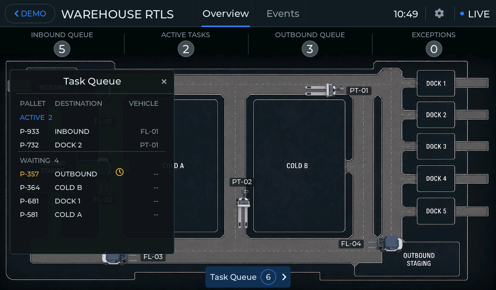
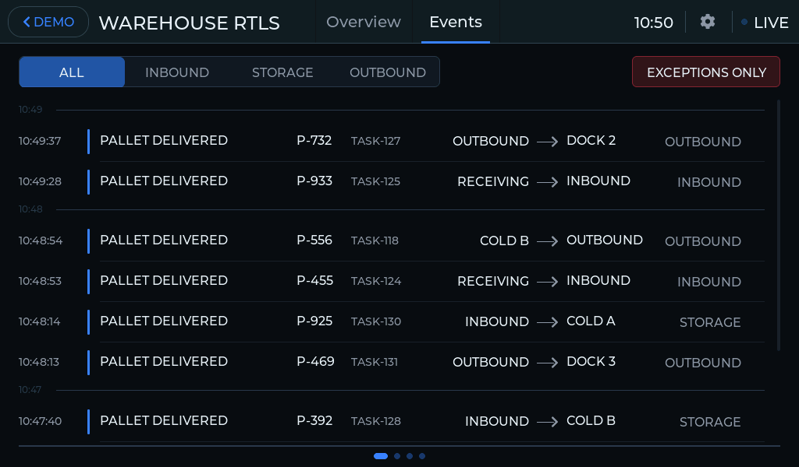
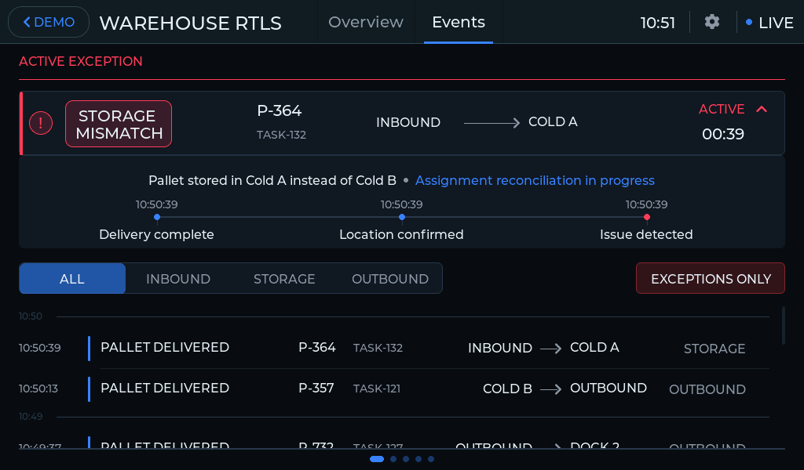
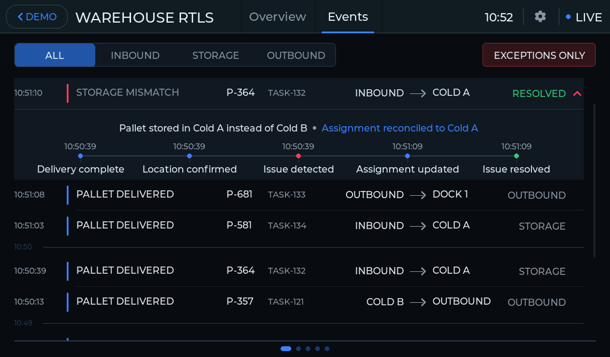

# Warehouse Flow: Real-Time Location & Operations Demo

**Follow warehouse movement, inspect operational context, and understand the events behind it.**

Warehouse Flow is a demonstration HMI for Elecrow CrowPanel Advanced ESP32-P4 panels with 1024 × 600 touch displays. It presents a distribution warehouse from the perspective of a supervisor or dispatcher in a Warehouse Control Center.

## Purpose: From Location to Operational Meaning

The application helps answer connected questions: **What is happening across the warehouse? Where is this load? How did it get here? Why did this event occur?**

A vehicle's position becomes more useful when it is connected to the pallet it carries, its task, its intended destination, and its recent activity. A completed movement can then be understood as a delivery, a shipment, or a deviation from the intended process.

**Location → Movement → Context → Event → Explanation → Corrected Flow**

The HMI combines a live map with object details and event evidence. The user can investigate an operation without losing its connection to the rest of the warehouse.

## Warehouse Model

The demonstration represents a food distribution warehouse with cold storage areas.

| Area | Purpose |
| --- | --- |
| Receiving | Accept incoming loads |
| Inbound Staging | Hold received pallets before storage |
| Cold Storage A / B | Store pallets between handling operations |
| Outbound Staging | Collect loads before shipment |
| Dock 1–5 | Hand loads over for shipping |

Normal internal transfers follow **Receiving → Inbound Staging → Cold Storage A/B → Outbound Staging → Dock**.

The model contains **25 pallet identities, four forklifts, and two pallet trucks**. Vehicles pick up loads, transport them along warehouse routes, unload them, and receive further work. Pallets have their own state and movement history. Shipping and replenishment keep the operation running through successive cycles.

Vehicles, tasks, loads, and events share one connected simulation. Vehicle movement follows warehouse routes and task execution.

All warehouse movements, tasks, and events are simulated locally. The demonstration can be explored without installing a real positioning network or connecting physical tags.

## Start the Demo

The Title screen offers **Guided Demo** and **Interactive HMI**.

Guided Demo is a repeating presentation of warehouse movement, operational context, and RTLS location. Its own visual examples introduce the concept. Tap the presentation to reveal **Open Interactive HMI**, then select that action to explore the warehouse.

Interactive HMI starts the warehouse simulation on first entry. Its primary sections are **Overview** and **Events**; object details and Task Queue open within the interface. The **< DEMO** button returns to Title. A running warehouse pauses while the presentation is open and continues when the user returns.

## Warehouse Overview

Overview gives the operator one view of the warehouse, its moving vehicles, and its active work. Zones and vehicles are selectable, so the map is also the entry point to their operational details.

The top strip presents **Inbound Queue**, **Active Tasks**, **Outbound Queue**, and **Exceptions**. The queue indicators describe staged inventory and waiting work in their respective areas without counting the same pallet twice. Inbound Queue refers to Inbound Staging; Outbound Queue refers to Outbound Staging and waiting shipping work.

<table width="100%">
  <tr>
    <td width="50%"></td>
    <td width="50%"></td>
  </tr>
  <tr>
    <td align="center"><strong>Normal operation</strong></td>
    <td align="center"><strong>Active exception on the map</strong></td>
  </tr>
</table>

Select either image to open its full-resolution screenshot.

The second example highlights **Dock 5** with a red outline and alarm marker; the Exceptions indicator shows one active condition. The map identifies where attention is needed. Selecting the marker opens the related event so the operator can investigate its cause.

The cause cannot be determined from the map alone. This Dock 5 example is separate from the Storage Mismatch sequence illustrated below.

## Zone Overview

A zone panel brings inventory and recent movement into one local view. The selected area remains visible on the warehouse map.

The panel combines **Status**, **Stored Pallets**, a selectable **Assets** list, and arrivals/departures on a ten-minute time rail. Recent Activity connects those movements with the vehicles that performed them. A zone-associated exception can be opened from its Status block.

The screenshot shows **Cold Storage B**, with five stored pallets, three arrivals, and one departure in the displayed window. Selecting a pallet opens its individual movement history and current context.

## Vehicle & Pallet Context

Vehicle and pallet panels answer different questions about the same operation. The vehicle view explains what the handling equipment is doing. The pallet view explains where a particular load is and how it reached that state.

<table width="100%">
  <tr>
    <td width="50%"></td>
    <td width="50%"></td>
  </tr>
  <tr>
    <td align="center"><strong>Vehicle Detail — FL-02</strong></td>
    <td align="center"><strong>Pallet Detail — P-732</strong></td>
  </tr>
</table>

Select an image to inspect the panel at full resolution. These are two independent examples, captured at different times.

### Vehicle Detail

The left screenshot shows **FL-02 transporting P-706 from Receiving to Inbound**. The panel displays the vehicle state, load, source and destination, and progress through **Pickup → Load → Transport → Unload**. Recent Activity provides the assignment and handling context.

Linked load and route cards open the corresponding pallet or zone. The operator can follow a relationship directly instead of searching a separate asset list.

### Pallet Detail

The right screenshot shows **P-732 on pallet truck PT-02**, with **Cold Storage B** as its next step. It is not the load carried by FL-02 in the adjacent screenshot.

The panel combines pallet status and lifecycle with **Current Location**, **Next Step**, and **Movement History**. While the pallet is in transit, its current location identifies the carrying vehicle. History explains the preceding movements of this particular load.

## Task Queue

The map shows physical activity; Task Queue shows the work behind it. Tasks are grouped as **Exceptions**, **Active**, and **Waiting**, with links to the associated event or pallet.

The example contains two active tasks and four waiting tasks. The amber clock beside **P-357** marks delayed waiting work. A delay is an attention indicator, not an exception or a change in task priority.

Normal traffic waiting does not by itself mean that a task has failed.

Ordinary rows open Pallet Detail. Exception rows open their associated event. Queue membership updates as the operation progresses.

## Live Events

Live Events is the history of the whole warehouse. It includes receiving, deliveries, and shipping as well as exceptions, allowing a problem to be understood alongside the surrounding operation.

History can be filtered by **All**, **Inbound**, **Storage**, or **Outbound**. **Exceptions Only** restricts history to exceptions. Active exceptions remain visible separately, regardless of the history filter.

Movement History and Live Events serve different purposes: one follows a single pallet, while the other records activity across the warehouse.

## Exception Explanation: Active to Resolved

Opening an exception reveals the cause and a timestamped evidence sequence. The operator can see both the conclusion and the operational facts behind it.

Controlled deviations include a destination becoming unavailable because of maintenance or restricted access, delivery to the wrong destination, and a mismatch between actual storage and the assigned storage area. Resolution follows the underlying condition.

The following two screenshots show the same **Storage Mismatch**, involving **P-364 / TASK-132**.

### Active: Storage Assignment Does Not Match the Actual Location

P-364 was stored in **Cold A instead of Cold B**. The active explanation shows delivery completion, location confirmation, and issue detection. Its current status reports **Assignment reconciliation in progress**.

### Resolved: Assignment Reconciled to Cold A

The same event later moves into history with **Resolved** status. Its completed evidence sequence adds **Assignment updated** and **Issue resolved**, and the explanation reports **Assignment reconciled to Cold A**.

This resolution reconciles the assignment with the actual compatible storage area. It does not show the pallet being transported back to Cold B. Other conditions can require different actions, such as corrective transport for a wrong delivery destination.

The simulation introduces and resolves controlled deviations automatically. The HMI exposes their context and evidence; the user does not press a manual recovery button.

## RTLS Technology Context

In a real warehouse, **UWB tags** on mobile assets and fixed **anchors** provide measurements to a locating engine. The calculated position becomes the input to the application's operational model.

**omlox Hub** provides a common location model with entities such as trackables, location providers, zones, and fences, and exposes REST/WebSocket interfaces. This allows an application to connect location information with its own asset and workflow context. **Open Location Hub** is one possible integration direction when adapting the concept.

The supplied demo uses a local warehouse simulation. Its presentation illustrates the RTLS concept, but the package does not connect to real UWB infrastructure or an external location hub.

Further background: [omlox Core Zone](https://omlox.com/omlox-explained/omlox-core-zone-and-air-interface) and [omlox Hub and API](https://omlox.com/omlox-explained/omlox-hub-and-api).

## Firmware

**[Download the Windows package — CrowPanel V1.2 / firmware v1.7](../CrowPanelv1.2_Warehouse_v1.7.zip)**

The package includes a ready-to-use flashing tool. Follow the [installation instructions](../README.md#flashing), then use the [User Manual](../USER_MANUAL.md) to explore the application.

## Customization — Build Your Own Warehouse HMI

This concept prototype provides a physical example for evaluating an interface and discussing a future warehouse solution.

It can be adapted to:

- your warehouse map, storage areas, and shipping docks;
- your asset types, operational states, and handling workflows;
- your UI, terminology, and branding;
- your event rules, explanations, and recovery processes;
- real RTLS data, including UWB and location-hub integrations;
- warehouse management systems and other application backends;
- the required CrowPanel hardware configuration.

Start by installing the free demo and exploring its behavior on the panel. A prototype for your own workflow can then establish the required screens, data relationships, and integration points before production development.

Settings, map editing, Event Replay, manual scenario selection, and production RTLS/WMS integration are not implemented features of the supplied release. Adapting the application to them is additional development work.

**[Discuss Your Project](mailto:hi@grovety.com)**
